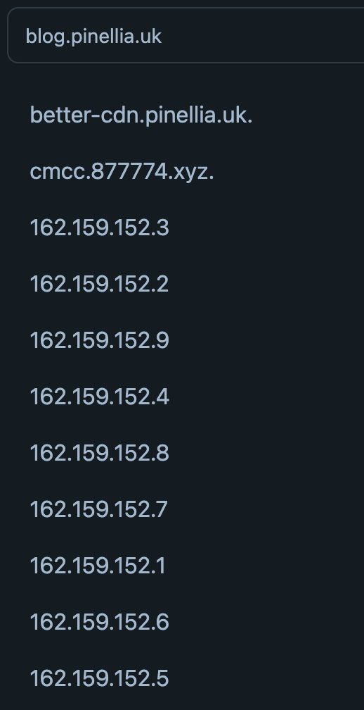
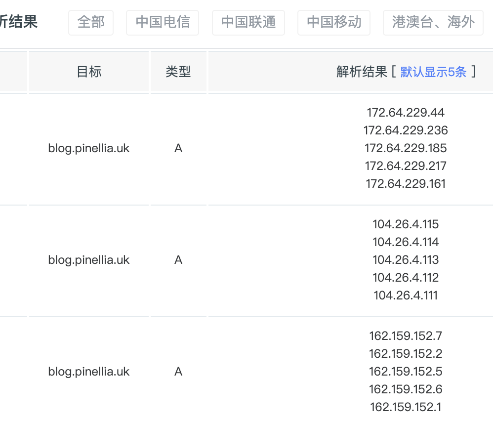

# 参考

https://cmliussss.com/p/BestWorkers/

## 结果记录

尝试加速本博客 blog.pinellia.uk为例

### itdog tcping全绿：


但本地的设备包括电脑手机，在走直连的情况下，访问极其受限，大部分情况下：

```
curl报错为curl: (35) LibreSSL SSL_connect: SSL_ERROR_SYSCALL in connection to blog.pinellia.uk 
浏览器报错：ERR_CONNECTION_CLOSED
```

### 确认非dns问题

clash的dns结果与itdog吻合：

<div style="display: flex; gap: 16px;">
    
    
</div>

尝试指定
找不到无法访问的原因，走代理的情况下能连接。
可以ping通解析出来的ip

rec：
平板和电脑等了很长时间莫名其妙就能连接了